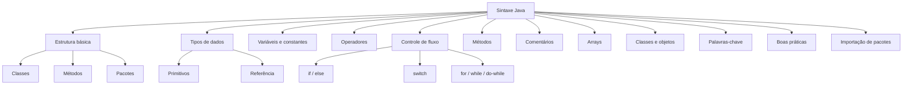

# dio-trilha-java-basico
Repositório para exemplos do curso de Java básico da DIO

## Sintaxe do java ☕

```mermaid
flowchart TD
    A[Sintaxe Java] --> B[Estrutura básica]
    A --> C[Tipos de dados]
    A --> D[Variáveis e constantes]
    A --> E[Operadores]
    A --> F[Controle de fluxo]
    A --> G[Métodos]
    A --> H[Comentários]
    A --> I[Arrays]
    A --> J[Classes e objetos]
    A --> K[Palavras-chave]
    A --> L[Boas práticas]
    A --> M[Importação de pacotes]

    B --> B1[Classes]
    B --> B2[Métodos]
    B --> B3[Pacotes]

    C --> C1[Primitivos]
    C --> C2[Referência]

    F --> F1[if / else]
    F --> F2[switch]
    F --> F3[for / while / do-while]

```
